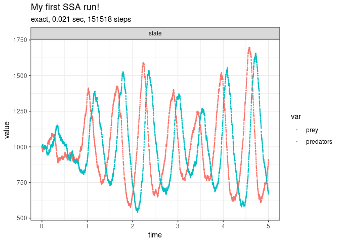

Introduction to GillespieSSA2
================

<!-- github markdown built using 
rmarkdown::render("vignettes/an_introduction.Rmd", output_format = "github_document")
-->

In order to invoke `ssa()`, the stochastic model needs at least three
components:

-   the initial state vector (`initial_state`),
-   the reactions (`reactions`),
-   the final time of the simulation (`final_time`).

The initial state vector defines the population sizes in all the states
at $t = 0$. For example, for a system with two species `prey` and
`predators` where both have an initial population size of 1000, the
initial state vector is defined as follows.

``` r
library(GillespieSSA2)
initial_state <- c(prey = 1000, predators = 1000)
```

The reactions define the change in the number of individuals that can
occur at any given timepoint during the simulation. During an
infinitesimal period of time, the reaction can occur with a probability
defined by its propensity function. For example, a system with
abovementioned species could have three reactions; one in which the prey
population grows, one in which the predator population grows by feasting
on the prey, and one in which the predator population diminishes. The
matrix could then be defined as follows.

``` r
params <- c(c1 = 10, c2 = 0.01, c3 = 10)
reactions <- list(
  #        propensity function        effects                          name for reaction
  reaction(~c1 * prey,                c(prey = +1),                    name = "prey_up"),
  reaction(~c2 * prey * predators,    c(prey = -1, predators = +1),    name = "predation"),
  reaction(~c3 * predators,           c(predators = -1),               name = "pred_down")
)
```

The simulation can be started by calling the `ssa()` function.

``` r
out <- 
  ssa(
    initial_state = initial_state,
    reactions = reactions,
    params = params,
    method = ssa_exact(),
    final_time = 5,
    census_interval = .001,
    verbose = TRUE,
    sim_name = "My first SSA run!"
  )
#> Running SSA exact with console output every 1 seconds
#> walltime: 0, sim_time: 0
#> SSA finished!
```

``` r
print(out$stats)
#>   method          sim_name sim_time_exceeded all_zero_state negative_state
#> 1  exact My first SSA run!              TRUE          FALSE          FALSE
#>   all_zero_propensity negative_propensity walltime_exceeded walltime_elapsed
#> 1               FALSE               FALSE             FALSE        0.2771259
#>   num_steps   dtime_mean     dtime_sd firings_mean firings_sd
#> 1    151518 3.299954e-05 1.538995e-07            1          0
```

``` r
plot_ssa(out)
```


