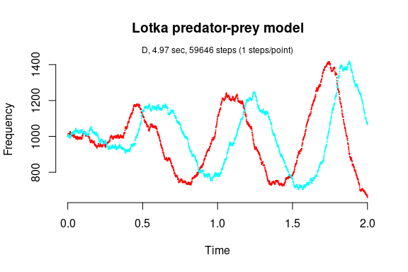

Converting from GillespieSSA to GillespieSSA2
================

<!-- github markdown built using 
rmarkdown::render("vignettes/converting_from_GillespieSSA.Rmd", output_format = "github_document")
-->

In this vignette, we will show how to upgrade the Lotka-predator-prey
model from GillespieSSA to GillespieSSA2. First, have a look at the
GillespieSSA vignette:

-   [CRAN
    Vignette](https://CRAN.R-project.org/package=GillespieSSA/vignettes/lotka_predator_prey.html)
-   `vignette("lotka_predator_prey", package = "GillespieSSA")`

The model consists of the following objects:

``` r
library(GillespieSSA)
parms <- c(c1 = 10, c2 = .01, c3 = 10)
tf <- 2                                        # Final time
simName <- "Lotka predator-prey model"         # Name
x0 <- c(Y1=1000, Y2=1000)
nu <- matrix(c(+1, -1, 0, 0, 1, -1), nrow = 2, byrow = TRUE)
a  <- c("c1*Y1", "c2*Y1*Y2","c3*Y2")
out <- GillespieSSA::ssa(
  x0 = x0,
  a = a,
  nu = nu,
  parms = parms,
  tf = tf,
  method = ssa.d(),
  simName = simName,
  censusInterval = .001,
  verbose = FALSE,
  consoleInterval = 1
) 
ssa.plot(out, show.title = TRUE, show.legend = FALSE)
```



In order to port these objects, it is preferable to use the updated
notation from the respective GillespieSSA2 vignette:

-   [CRAN
    Vignette](https://CRAN.R-project.org/package=GillespieSSA2/vignettes/lotka_predator_prey.html)
-   `vignette("lotka_predator_prey", package = "GillespieSSA2")`

``` r
library(GillespieSSA2)
sim_name <- "Lotka Predator-Prey model"
params <- c(c1 = 10, c2 = .01, c3 = 10)
final_time <- 2
initial_state <- c(Y1 = 1000, Y2 = 1000)
reactions <- list(
  reaction("c1 * Y1",      c(Y1 = +1)),
  reaction("c2 * Y1 * Y2", c(Y1 = -1, Y2 = +1)),
  reaction("c3 * Y2",      c(Y2 = -1))
)
out <- GillespieSSA2::ssa(
  initial_state = initial_state,
  reactions = reactions,
  params = params,
  final_time = final_time,
  method = ssa_exact(),
  census_interval = .001,
  verbose = FALSE,
  sim_name = sim_name
) 
plot_ssa(out)
```


However, if you want to use the GillespieSSA1 objects directly, you can
also transform these programmatically. The interface of GillespieSSA2 is
very similar, it only requires you to use different parameter names, and
combine the state-change matrix `nu` and the propensity functions `a`
into one list of reactions.

``` r
out <- 
  GillespieSSA2::ssa(
    initial_state = x0,
    reactions = port_reactions(x0 = x0, a = a, nu = nu),
    params = parms,
    method = ssa_exact(),
    final_time = tf,
    census_interval = .001,
    verbose = FALSE,
    sim_name = simName
  )
print(out$stats)
#>   method                  sim_name sim_time_exceeded all_zero_state
#> 1  exact Lotka predator-prey model              TRUE          FALSE
#>   negative_state all_zero_propensity negative_propensity walltime_exceeded
#> 1          FALSE               FALSE               FALSE             FALSE
#>   walltime_elapsed num_steps  dtime_mean     dtime_sd firings_mean firings_sd
#> 1        0.1121878     61805 3.23602e-05 1.378919e-08            1          0
plot_ssa(out)
```


