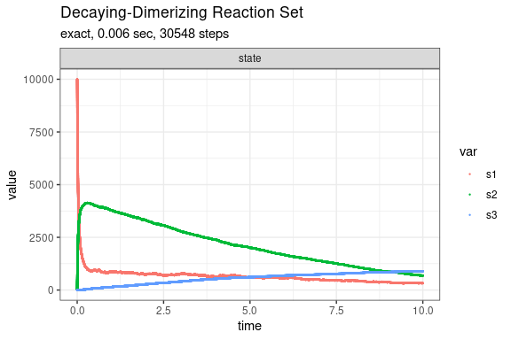
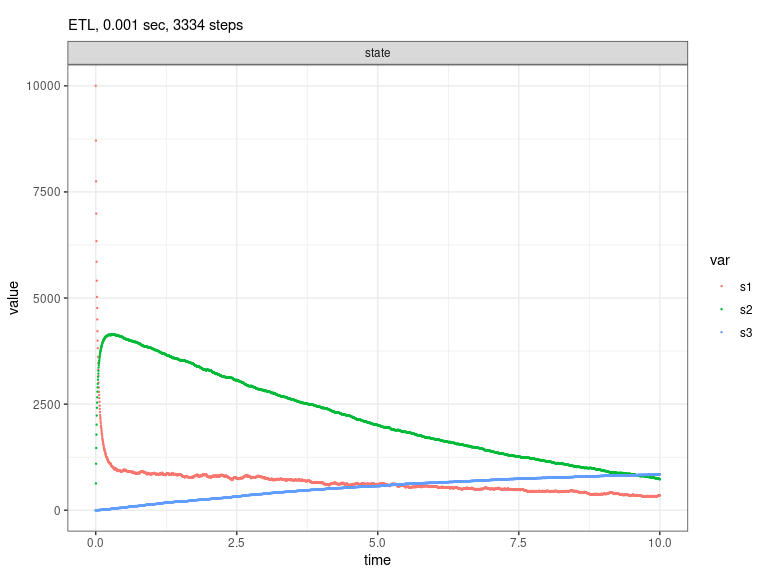
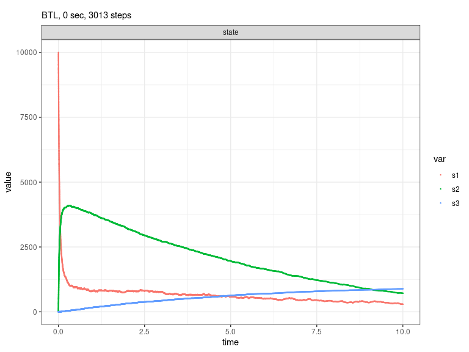

Decaying-Dimerization Reaction Set (Gillespie, 2001)
================

<!-- github markdown built using 
rmarkdown::render("vignettes/decaying_dimer.Rmd", output_format = "github_document")
-->

The Decaying-Dimerization Reaction Set consists of three species and
four reaction channels.

``` 
      S1 --c1--> 0
 S1 + S1 --c2--> S2
      S2 --c3--> S1 + S1
      S2 --c4--> S3
```

Define parameters

``` r
library(GillespieSSA2)
sim_name <- "Decaying-Dimerizing Reaction Set"
final_time <- 10
params <- c(c1 = 1.0, c2 = 0.002, c3 = 0.5, c4 = 0.04)
initial_state <- c(s1 = 10000, s2 = 0, s3 = 0)
```

Define reactions

``` r
reactions <- list(
  reaction("c1 * s1",        c(s1 = -1)),
  reaction("c2 * s1 * s1",   c(s1 = -2, s2 = +1)),
  reaction("c3 * s2",        c(s1 = +2, s2 = -1)),
  reaction("c4 * s2",        c(s2 = -1, s3 = +1))
)
```

Run simulations with the Exact method

``` r
set.seed(1)
out <- ssa(
  initial_state = initial_state,
  reactions = reactions,
  params = params,
  final_time = final_time,
  method = ssa_exact(),
  sim_name = sim_name
)
plot_ssa(out)
```

<!-- -->

Run simulations with the Explict tau-leap method

``` r
set.seed(1)
out <- ssa(
  initial_state = initial_state,
  reactions = reactions,
  params = params,
  final_time = final_time,
  method = ssa_etl(tau = 0.003),
  sim_name = sim_name
) 
plot_ssa(out)
```

<!-- -->

Run simulations with the Binomial tau-leap method

``` r
set.seed(1)
out <- ssa(
  initial_state = initial_state,
  reactions = reactions,
  params = params,
  final_time = final_time,
  method = ssa_btl(),
  sim_name = sim_name
) 
plot_ssa(out)
```

<!-- -->
