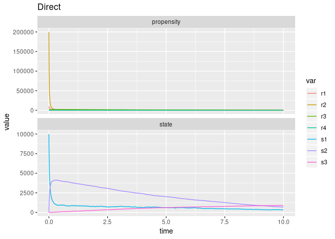
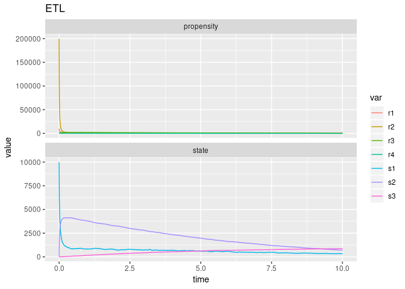
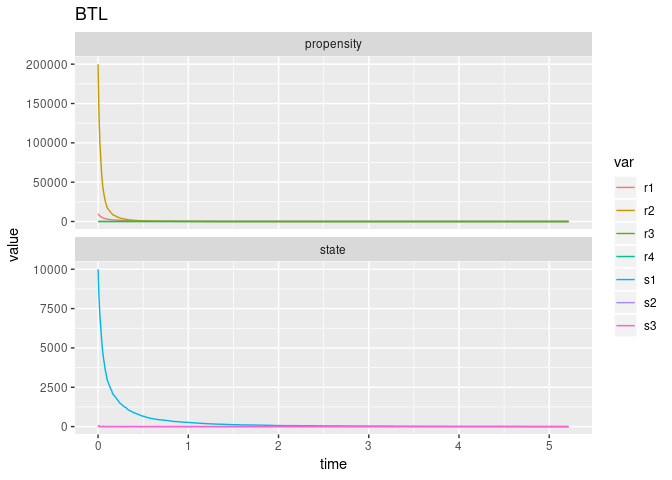

Decaying-Dimerisation
================
2019-06-21

<!-- github markdown built using 
rmarkdown::render("vignettes/decaying_dimer.Rmd", output_format = "github_document")
-->

``` r
library(fastgssa)
library(ggplot2)
```

The Decaying-Dimerisation Reaction Set consists of three species and
four reaction channels,

\[
\begin{aligned}
  s_1 & \overset{c_1}{\rightarrow} 0 \\
  s_1 + s_2 & \overset{c_2}{\rightarrow} s_2 \\
  s_2 & \overset{c_3}{\rightarrow} s_1 + s_2 \\
  s_2 & \overset{c_4}{\rightarrow} s_3 
\end{aligned}
\]

Define parameters

``` r
params <- c(c1 = 1.0, c2 = 0.002, c3 = 0.5, c4 = 0.04)
```

Initial state vector

``` r
initial_state <- c(s1 = 10000, s2 = 0, s3 = 0)
```

State-change matrix

``` r
nu <- matrix(
  c(
    -1, -2, +2,  0,
    0, +1, -1, -1,
    0,  0,  0, +1
  ),
  nrow = 3,
  byrow = TRUE
)
```

Propensity functions

``` r
propensity_funs <- c(
  "r1 = c1 * s1",
  "r2 = c2 * s1 * s1",
  "r3 = c3 * s2",
  "r4 = c4 * s2"
)
```

Run simulation with direct method

``` r
out <- 
  ssa(
    initial_state = initial_state,
    propensity_funs = propensity_funs,
    nu = nu,
    params = params,
    method = ssa_direct(),
    final_time = 10,
    census_interval = .01,
    verbose = TRUE
  )
```

    ## Running SSA direct with console output every 1 seconds
    ## Start time: CURRTIME
    ## walltime: 0, simtime: 0
    ## SSA finished!

``` r
print(out$stats)
```

    ##   method stop_simtime stop_extinction stop_negative_state stop_zero_prop
    ## 1 direct         TRUE           FALSE               FALSE          FALSE
    ##   stop_walltime walltime_start walltime_end walltime_elapsed num_steps
    ## 1         FALSE     1561117919   1561117919                0     30548
    ##     dtime_mean     dtime_sd
    ## 1 0.0003273901 1.098942e-05

``` r
ssa_plot(out) + labs(title = "Direct")
```

<!-- -->

Run simulation with ETL method

``` r
out <- 
  ssa(
    initial_state = initial_state,
    propensity_funs = propensity_funs,
    nu = nu,
    params = params,
    method = ssa_etl(.01),
    final_time = 10,
    census_interval = .01,
    verbose = FALSE
  )
ssa_plot(out) + labs(title = "ETL")
```

<!-- -->

Run simulation with BTL method

``` r
out <- 
  ssa(
    initial_state = initial_state,
    propensity_funs = propensity_funs,
    nu = nu,
    params = params,
    method = ssa_btl(f = .1),
    final_time = 10,
    census_interval = .01,
    verbose = FALSE,
    stop_on_neg_state = FALSE
  )
```

    ## Warning in simulate(propensity_funs = comp_funs$functions_pointer,
    ## num_functions = comp_funs$num_functions, : coerced p to unity - consider
    ## lowering f

``` r
out$stats
```

    ##   method stop_simtime stop_extinction stop_negative_state stop_zero_prop
    ## 1    BTL        FALSE            TRUE                TRUE           TRUE
    ##   stop_walltime walltime_start walltime_end walltime_elapsed num_steps
    ## 1         FALSE     1561117926   1561117926                0    100385
    ##     dtime_mean   dtime_sd
    ## 1 5.194919e-05 0.00031483

``` r
ssa_plot(out) + labs(title = "BTL")
```

<!-- -->

Run simulation with EM method

``` r
out <- 
  ssa(
    initial_state = initial_state,
    propensity_funs = propensity_funs,
    nu = nu,
    params = params,
    method = ssa_em(),
    final_time = 10,
    census_interval = .01,
    verbose = FALSE
  )
ssa_plot(out) + labs(title = "EM")
```

<!-- -->
