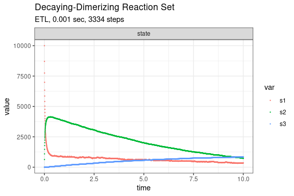
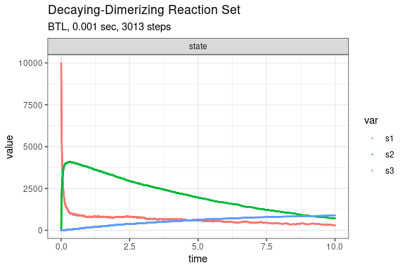

Decaying-Dimerisation
================
2019-07-17

<!-- github markdown built using 
rmarkdown::render("vignettes/decaying_dimer.Rmd", output_format = "github_document")
-->

``` r
library(gillespie)
library(ggplot2)
```

The Decaying-Dimerisation Reaction Set consists of three species and
four reaction channels,

``` 
     S1 --c1--> 0
S1 + S1 --c2--> S2
     S2 --c3--> S1 + S1
     S2 --c4--> S3
```

Define system

``` r
params <- c(c1 = 1.0, c2 = 0.002, c3 = 0.5, c4 = 0.04)
initial_state <- c(s1 = 10000, s2 = 0, s3 = 0)

#          ↓ propensity       ↓ effect(s)
reactions <- list(
  reaction(~ c1 * s1,         c(s1 = -1)),
  reaction(~ c2 * s1 * s1,    c(s1 = -2, s2 = +1)),
  reaction(~ c3 * s2,         c(s1 = +2, s2 = -1)),
  reaction(~ c4 * s2,         c(s2 = -1, s3 = +1))
)
```

Run simulation with direct method

``` r
out <- 
  ssa(
    initial_state = initial_state,
    reactions = reactions,
    params = params,
    method = ssa_direct(),
    final_time = 10,
    census_interval = .01,
    verbose = TRUE
  )
```

    ## Running SSA direct with console output every 1 seconds
    ## Start time: CURRTIME
    ## walltime: 0, simtime: 0
    ## SSA finished!

``` r
print(out$stats)
```

    ##   method stop_simtime stop_extinction stop_negative_state stop_zero_prop
    ## 1 direct         TRUE           FALSE               FALSE          FALSE
    ##   stop_walltime walltime_start walltime_end walltime_elapsed num_steps
    ## 1         FALSE     1563352262   1563352262                0     30548
    ##     dtime_mean     dtime_sd
    ## 1 0.0003273901 1.098942e-05

``` r
ssa_plot(out) + labs(title = "Direct")
```

<!-- -->

Run simulation with ETL method

``` r
out <- 
  ssa(
    initial_state = initial_state,
    reactions = reactions,
    params = params,
    method = ssa_etl(.01),
    final_time = 10,
    census_interval = .01,
    verbose = FALSE
  )
out$stats
```

    ##   method stop_simtime stop_extinction stop_negative_state stop_zero_prop
    ## 1    ETL         TRUE           FALSE               FALSE          FALSE
    ##   stop_walltime walltime_start walltime_end walltime_elapsed num_steps
    ## 1         FALSE     1563352265   1563352265                0      1001
    ##   dtime_mean     dtime_sd
    ## 1       0.01 4.824984e-18

``` r
ssa_plot(out) + labs(title = "ETL")
```

<!-- -->

Run simulation with BTL method

``` r
out <- 
  ssa(
    initial_state = initial_state,
    reactions = reactions,
    params = params,
    method = ssa_btl(f = .1),
    final_time = 10,
    census_interval = .01,
    verbose = FALSE,
    stop_on_neg_state = FALSE
  )
```

    ## Warning in simulate(propensity_funs =
    ## compiled_reactions$functions_pointer, : coerced p to unity - consider
    ## lowering f

``` r
out$stats
```

    ##   method stop_simtime stop_extinction stop_negative_state stop_zero_prop
    ## 1    BTL        FALSE            TRUE                TRUE           TRUE
    ##   stop_walltime walltime_start walltime_end walltime_elapsed num_steps
    ## 1         FALSE     1563352268   1563352268                0    100385
    ##     dtime_mean   dtime_sd
    ## 1 5.194919e-05 0.00031483

``` r
ssa_plot(out) + labs(title = "BTL")
```

<!-- -->

Run simulation with EM method

``` r
out <- 
  ssa(
    initial_state = initial_state,
    reactions = reactions,
    params = params,
    method = ode_em(),
    final_time = 10,
    census_interval = .01,
    verbose = FALSE
  )
out$stats
```

    ##   method stop_simtime stop_extinction stop_negative_state stop_zero_prop
    ## 1     EM         TRUE           FALSE               FALSE          FALSE
    ##   stop_walltime walltime_start walltime_end walltime_elapsed num_steps
    ## 1         FALSE     1563352272   1563352272                0      1001
    ##   dtime_mean     dtime_sd
    ## 1       0.01 4.824984e-18

``` r
ssa_plot(out) + labs(title = "EM")
```

<!-- -->
