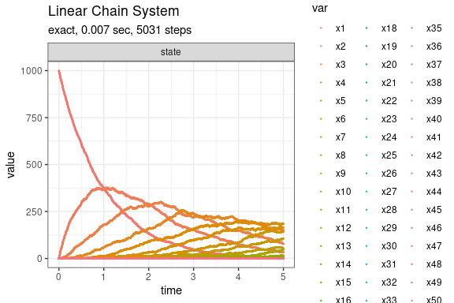
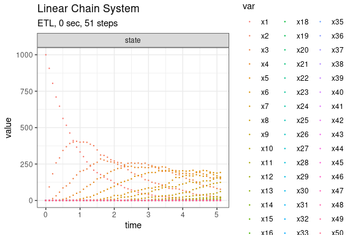

Linear Chain System
================

<!-- github markdown built using 
rmarkdown::render("vignettes/linear_chain.Rmd", output_format = "github_document")
-->

The Linear Chain System (Cao, Li, and Petzold 2004) consists of M chain
reactions with M+1 species as follows:

      S_1 --c1--> S_2
      S_2 --c2--> S_3
           ...
      S_M --cM--> S_(M+1)

Define parameters

``` r
library(GillespieSSA2)
sim_name <- "Linear Chain System"
M <- 50
params <- c(c = 1)
final_time <- 5
initial_state <- c(1000, rep(0, M)) 
names(initial_state) <- paste0("x", seq_len(M+1))
```

Define the reactions

``` r
reactions <- lapply(
  seq_len(M),
  function(i) {
    effect <- c(-1, 1)
    names(effect) <- paste0("x", c(i, i + 1))
    
    reaction(paste0("c * x", i), effect)
  }
)
```

Run simulations with the Exact method

``` r
set.seed(1)
out <- ssa(
  initial_state = initial_state,
  reactions = reactions,
  params = params,
  final_time = final_time,
  method = ssa_exact(),
  sim_name = sim_name
) 
plot_ssa(out)
```



Run simulations with the Explict tau-leap method

``` r
set.seed(1)
out <- ssa(
  initial_state = initial_state,
  reactions = reactions,
  params = params,
  final_time = final_time,
  method = ssa_etl(tau = .1),
  sim_name = sim_name
) 
plot_ssa(out)
```



Run simulations with the Binomial tau-leap method

``` r
set.seed(1)
out <- ssa(
  initial_state = initial_state,
  reactions = reactions,
  params = params,
  final_time = final_time,
  method = ssa_btl(mean_firings = 50),
  sim_name = sim_name
) 
plot_ssa(out)
```


## References

<div id="refs" class="references csl-bib-body hanging-indent">

<div id="ref-Cao2004" class="csl-entry">

Cao, Yang, Hong Li, and Linda Petzold. 2004. “Efficient Formulation of
the Stochastic Simulation Algorithm for Chemically Reacting Systems.”
*The Journal of Chemical Physics* 121 (9): 4059–67.
<https://doi.org/10.1063/1.1778376>.

</div>

</div>
