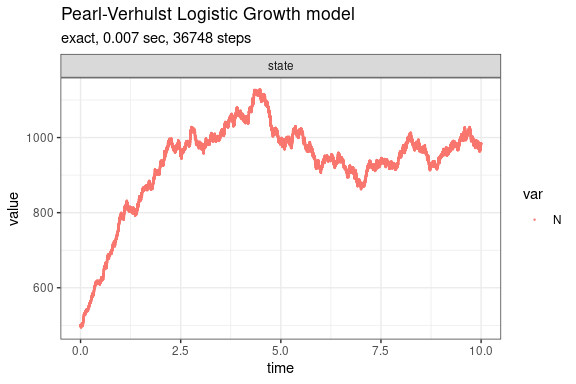

Pearl-Verhulst Logistic Growth model (Kot, 2001)
================

<!-- github markdown built using 
rmarkdown::render("vignettes/logistic_growth.Rmd", output_format = "github_document")
-->

The logistic growth model is given by `dN/dt = rN(1-N/K)` where `N` is
the number (density) of indviduals at time `t`, `K` is the carrying
capacity of the population, `r` is the intrinsic growth rate of the
population. We assume `r=b-d` where `b` is the per capita p.c. birth
rate and `d` is the p.c. death rate.

This model consists of two reaction channels,

``` 
 N ---b--->  N + N
 N ---d'---> 0
```

where `d'=d+(b-d)N/K`. The propensity functions are `a_1=bN` and
`a_2=d'N`.

Define parameters

``` r
library(GillespieSSA2)
sim_name <- "Pearl-Verhulst Logistic Growth model"
params <- c(b = 2, d = 1, K = 1000)
final_time <- 10
initial_state <- c(N = 500)
```

Define reactions

``` r
reactions <- list(
  reaction("b * N", c(N = +1)),
  reaction("(d + (b - d) * N / K) * N", c(N = -1))
)
```

Run simulations with the Exact method

``` r
set.seed(1)
out <- ssa(
  initial_state = initial_state,
  reactions = reactions,
  params = params,
  final_time = final_time,
  method = ssa_exact(),
  sim_name = sim_name
) 
autoplot.ssa(out)
```

<!-- -->

Run simulations with the Explict tau-leap method

``` r
set.seed(1)
out <- ssa(
  initial_state = initial_state,
  reactions = reactions,
  params = params,
  final_time = final_time,
  method = ssa_etl(tau = .03),
  sim_name = sim_name
) 
autoplot.ssa(out)
```

<!-- -->

Run simulations with the Binomial tau-leap method

``` r
set.seed(1)
out <- ssa(
  initial_state = initial_state,
  reactions = reactions,
  params = params,
  final_time = final_time,
  method = ssa_btl(mean_firings = 5),
  sim_name = sim_name
) 
autoplot.ssa(out)
```

<!-- -->
