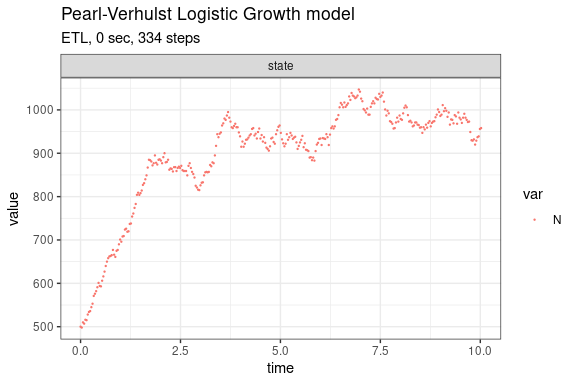
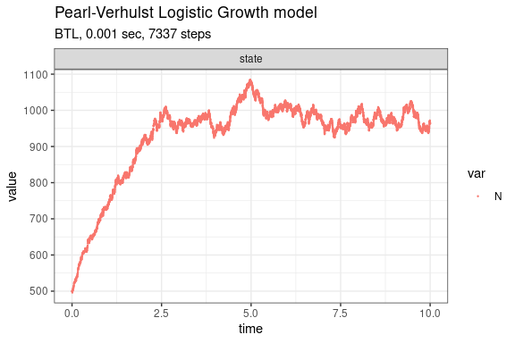

Pearl-Verhulst Logistic Growth model
================

<!-- github markdown built using 
rmarkdown::render("vignettes/logistic_growth.Rmd", output_format = "github_document")
-->

The classical logistic-growth model (Kot 2001) assumes that the growth
of a population decreases with increasing population size and is given
by the following equation,

$$
\frac{dN}{dt} = rN \times \left(1 - \frac{N}{K}\right)
$$ where $N$ is the number (density) of indviduals at time $t$, $K$ is
the carrying capacity of the population, $r$ is the intrinsic growth
rate of the population.

This model consists of two reactions, birth and death, whose propensity
functions are defined as:

-   $a_1(x) = bN$
-   $a_2(x) = (d + (b - d) \times N / K) \times N$

where $b$ is the per capita birth rate and $d$ is the per capita death
rate.

Assuming $b=2$, $d=1$, $K=1000$ and $X(0)=(500)$, we can define the
following parameters:

``` r
library(GillespieSSA2)
sim_name <- "Pearl-Verhulst Logistic Growth model"
params <- c(b = 2, d = 1, K = 1000)
final_time <- 10
initial_state <- c(N = 500)
```

The reactions (each consisting of a propensity function and a state
change vector) can be defined as:

``` r
reactions <- list(
  reaction("b * N", c(N = +1)),
  reaction("(d + (b - d) * N / K) * N", c(N = -1))
)
```

Run simulations with the Exact method

``` r
set.seed(1)
out <- ssa(
  initial_state = initial_state,
  reactions = reactions,
  params = params,
  final_time = final_time,
  method = ssa_exact(),
  sim_name = sim_name
) 
plot_ssa(out)
```


Run simulations with the Explict tau-leap method

``` r
set.seed(1)
out <- ssa(
  initial_state = initial_state,
  reactions = reactions,
  params = params,
  final_time = final_time,
  method = ssa_etl(tau = .03),
  sim_name = sim_name
) 
plot_ssa(out)
```



Run simulations with the Binomial tau-leap method

``` r
set.seed(1)
out <- ssa(
  initial_state = initial_state,
  reactions = reactions,
  params = params,
  final_time = final_time,
  method = ssa_btl(mean_firings = 5),
  sim_name = sim_name
) 
plot_ssa(out)
```



## References

<div id="refs" class="references csl-bib-body hanging-indent">

<div id="ref-Kot2001" class="csl-entry">

Kot, Mark. 2001. *Elements of Mathematical Ecology*. Cambridge
University Press. <https://doi.org/10.1017/cbo9780511608520>.

</div>

</div>
