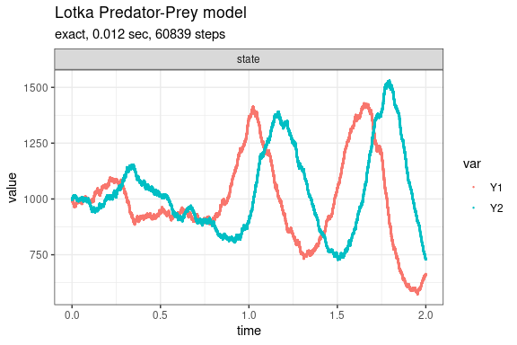

Lotka Predator-Prey model
================

<!-- github markdown built using 
rmarkdown::render("vignettes/lotka_predator_prey.Rmd", output_format = "github_document")
-->

This version of the Lotka predator-prey model (Gillespie 1977; Kot 2001)
is given by

    dY1/dt = c1*Y1 - c2*Y1*Y2
    dY2/dt = c2*Y1*Y2 - c3*Y2

consisting of the three reaction channels,

          Y1 --c1--> Y1 + Y1 
     Y1 + Y2 --c2--> Y2 + Y2 
          Y1 --c3--> 0

Define parameters

``` r
library(GillespieSSA2)
sim_name <- "Lotka Predator-Prey model"
params <- c(c1 = 10, c2 = .01, c3 = 10)
final_time <- 2
initial_state <- c(Y1 = 1000, Y2 = 1000)
```

Define reactions

``` r
reactions <- list(
  reaction("c1 * Y1", c(Y1 = +1)),
  reaction("c2 * Y1 * Y2", c(Y1 = -1, Y2 = +1)),
  reaction("c3 * Y2", c(Y2 = -1))
)
```

Run simulations with the Exact method

``` r
set.seed(1)
out <- ssa(
  initial_state = initial_state,
  reactions = reactions,
  params = params,
  final_time = final_time,
  method = ssa_exact(),
  sim_name = sim_name
) 
plot_ssa(out)
```



Run simulations with the Explict tau-leap method

``` r
set.seed(1)
out <- ssa(
  initial_state = initial_state,
  reactions = reactions,
  params = params,
  final_time = final_time,
  method = ssa_etl(tau = .002),
  sim_name = sim_name
) 
plot_ssa(out)
```


Run simulations with the Binomial tau-leap method

``` r
set.seed(1)
out <- ssa(
  initial_state = initial_state,
  reactions = reactions,
  params = params,
  final_time = final_time,
  method = ssa_btl(mean_firings = 100),
  sim_name = sim_name
) 
plot_ssa(out)
```


<div id="refs" class="references csl-bib-body hanging-indent">

<div id="ref-Gillespie1977" class="csl-entry">

Gillespie, Daniel T. 1977. “Exact Stochastic Simulation of Coupled
Chemical Reactions.” *The Journal of Physical Chemistry* 81 (25):
2340–61. <https://doi.org/10.1021/j100540a008>.

</div>

<div id="ref-Kot2001" class="csl-entry">

Kot, Mark. 2001. *Elements of Mathematical Ecology*. Cambridge
University Press. <https://doi.org/10.1017/cbo9780511608520>.

</div>

</div>
