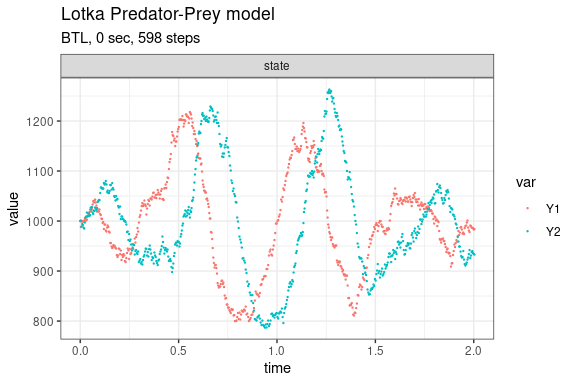

Lotka predator-prey model (Gillespie, 1977; Kot, 2001)
================

<!-- github markdown built using 
rmarkdown::render("vignettes/lotka_predator_prey.Rmd", output_format = "github_document")
-->

This version of the Lotka predator-prey model is given by

    dY1/dt = c1*Y1 - c2*Y1*Y2
    dY2/dt = c2*Y1*Y2 - c3*Y2

consisting of the three reaction channels,

``` 
      Y1 --c1--> Y1 + Y1 
 Y1 + Y2 --c2--> Y2 + Y2 
      Y1 --c3--> 0
```

Load package

``` r
library(gillespie)
```

Define parameters

``` r
params <- c(c1 = 10, c2 = .01, c3 = 10)
final_time <- 2
initial_state <- c(Y1 = 1000, Y2 = 1000)
```

Define reactions

``` r
reactions <- list(
  reaction("c1 * Y1", c(Y1 = +1)),
  reaction("c2 * Y1 * Y2", c(Y1 = -1, Y2 = +1)),
  reaction("c3 * Y2", c(Y2 = -1))
)
```

Run simulations with the Direct method

``` r
set.seed(1)
out <- ssa(
  initial_state = initial_state,
  reactions = reactions,
  params = params,
  final_time = final_time,
  method = ssa_direct()
) 
ssa_plot(out)
```


Run simulations with the Explict tau-leap method

``` r
set.seed(1)
out <- ssa(
  initial_state = initial_state,
  reactions = reactions,
  params = params,
  final_time = final_time,
  method = ssa_etl(tau = .002)
) 
ssa_plot(out)
```


Run simulations with the Binomial tau-leap method

``` r
set.seed(1)
out <- ssa(
  initial_state = initial_state,
  reactions = reactions,
  params = params,
  final_time = final_time,
  method = ssa_btl(f = 100)
) 
ssa_plot(out)
```


