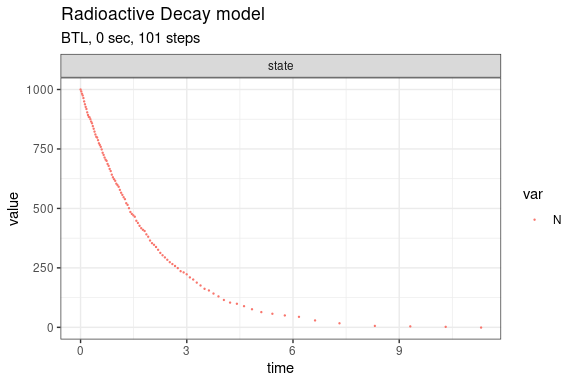

Radioactive Decay model (Gillespie, 1977)
================

<!-- github markdown built using 
rmarkdown::render("vignettes/radioactive_decay.Rmd", output_format = "github_document")
-->

This model is also known as the irreversible isomerization reaction set.
It consists of a single species and single reaction channels,

    X --c--> 0

Define parameters

``` r
library(GillespieSSA2)
sim_name <- "Radioactive Decay model"
params <- c(k = 0.5)
final_time <- 20
initial_state <- c(N = 1000)
```

Define reactions

``` r
reactions <- list(
  reaction("k * N", c(N = -1))
)
```

Run simulations with the Exact method

``` r
set.seed(1)
out <- ssa(
  initial_state = initial_state,
  reactions = reactions,
  params = params,
  final_time = final_time,
  method = ssa_exact(),
  sim_name = sim_name
) 
autoplot.ssa(out)
```

<!-- -->

Run simulations with the Explict tau-leap method

``` r
set.seed(1)
out <- ssa(
  initial_state = initial_state,
  reactions = reactions,
  params = params,
  final_time = final_time,
  method = ssa_etl(tau = .003),
  sim_name = sim_name
) 
autoplot.ssa(out)
```

<!-- -->

Run simulations with the Binomial tau-leap method

``` r
set.seed(1)
out <- ssa(
  initial_state = initial_state,
  reactions = reactions,
  params = params,
  final_time = final_time,
  method = ssa_btl(),
  sim_name = sim_name
) 
autoplot.ssa(out)
```

<!-- -->
