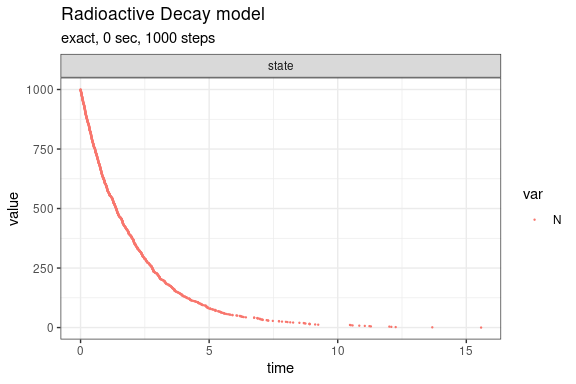

Radioactive Decay model
================

<!-- github markdown built using 
rmarkdown::render("vignettes/radioactive_decay.Rmd", output_format = "github_document")
-->

This model is also known as the irreversible isomerization reaction set
(Gillespie 1977). It consists of a single species and single reaction
channels,

    X --c--> 0

Define parameters

``` r
library(GillespieSSA2)
sim_name <- "Radioactive Decay model"
params <- c(k = 0.5)
final_time <- 20
initial_state <- c(N = 1000)
```

Define reactions

``` r
reactions <- list(
  reaction("k * N", c(N = -1))
)
```

Run simulations with the Exact method

``` r
set.seed(1)
out <- ssa(
  initial_state = initial_state,
  reactions = reactions,
  params = params,
  final_time = final_time,
  method = ssa_exact(),
  sim_name = sim_name
) 
plot_ssa(out)
```



Run simulations with the Explict tau-leap method

``` r
set.seed(1)
out <- ssa(
  initial_state = initial_state,
  reactions = reactions,
  params = params,
  final_time = final_time,
  method = ssa_etl(tau = .003),
  sim_name = sim_name
) 
plot_ssa(out)
```


Run simulations with the Binomial tau-leap method

``` r
set.seed(1)
out <- ssa(
  initial_state = initial_state,
  reactions = reactions,
  params = params,
  final_time = final_time,
  method = ssa_btl(),
  sim_name = sim_name
) 
plot_ssa(out)
```


<div id="refs" class="references csl-bib-body hanging-indent">

<div id="ref-Gillespie1977" class="csl-entry">

Gillespie, Daniel T. 1977. “Exact Stochastic Simulation of Coupled
Chemical Reactions.” *The Journal of Physical Chemistry* 81 (25):
2340–61. <https://doi.org/10.1021/j100540a008>.

</div>

</div>
