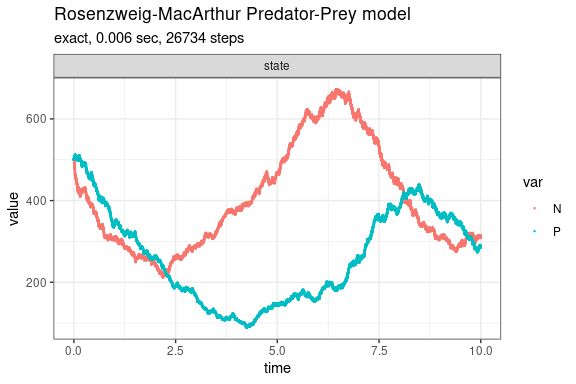
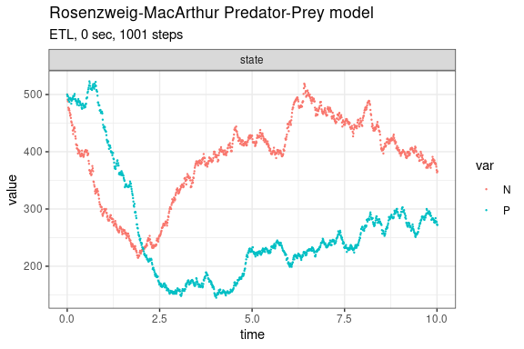
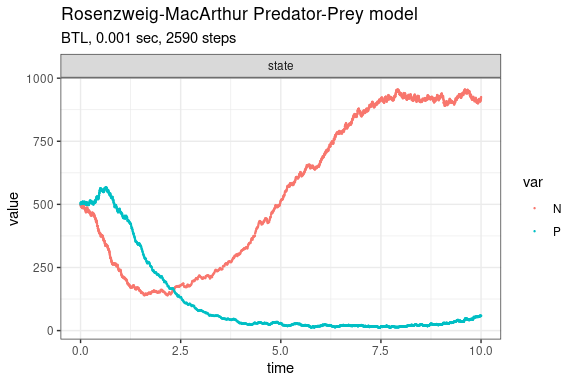

Rosenzweig-MacArthur Predator-Prey model
================

<!-- github markdown built using 
rmarkdown::render("vignettes/rm_predator_prey.Rmd", output_format = "github_document")
-->

Rosenzweig-MacArthur predator-prey model (Pineda-Krch et al. 2007).

    dN/dt = r(1-N/K - alpha/(1+wN))NP
    dP/dt = c*alpha/(1+wN))NP

This model has five reactions with the following per capita rates,

    prey birth:     b
    prey death:     d+(b-d)N/K
    predation:      alpha/(1+wN)
    predator birth: c*alpha/(1+wN)N
    predator death: g

Propensity functions:

    a1 = b * N
    a2 = (d+(b-d)N/K) * N
    a3 = alpha/(1+wN) * N * P
    a4 = c*alpha/(1+wN) * N * P
    a5 = g * P

Define parameters

``` r
library(GillespieSSA2)
sim_name <- "Rosenzweig-MacArthur Predator-Prey model"
params <- c(
  b = 2, 
  d = 1,
  K = 1000,
  alpha = 0.005, 
  w = 0.0025,
  c = 2,
  g = 2
)
final_time <- 10
initial_state  <- c(N = 500, P = 500)
```

Define reactions

``` r
reactions <- list(
  reaction("b * N", c(N = +1)),
  reaction("(d + (b - d) * N / K) * N", c(N = -1)),
  reaction("alpha / (1 + w * N) * N * P", c(N = -1)),
  reaction("c * alpha / ( 1 + w * N) * N * P", c(P = +1)),
  reaction("g * P", c(P = -1))
)
```

Run simulations with the Exact method

``` r
set.seed(1)
out <- ssa(
  initial_state = initial_state,
  reactions = reactions,
  params = params,
  final_time = final_time,
  method = ssa_exact(),
  sim_name = sim_name
) 
plot_ssa(out)
```



Run simulations with the Explict tau-leap method

``` r
set.seed(1)
out <- ssa(
  initial_state = initial_state,
  reactions = reactions,
  params = params,
  final_time = final_time,
  method = ssa_etl(tau = .01),
  sim_name = sim_name
) 
plot_ssa(out)
```



Run simulations with the Binomial tau-leap method

``` r
set.seed(1)
out <- ssa(
  initial_state = initial_state,
  reactions = reactions,
  params = params,
  final_time = final_time,
  method = ssa_btl(),
  sim_name = sim_name
) 
plot_ssa(out)
```



## References

<div id="refs" class="references csl-bib-body hanging-indent">

<div id="ref-PinedaKrch2007" class="csl-entry">

Pineda-Krch, Mario, Hendrik J. Blok, Ulf Dieckmann, and Michael Doebeli.
2007. “A Tale of Two Cycles – Distinguishing Quasi-Cycles and Limit
Cycles in Finite Predator–Prey Populations.” *Oikos* 116 (1): 53–64.
https://doi.org/<https://doi.org/10.1111/j.2006.0030-1299.14940.x>.

</div>

</div>
