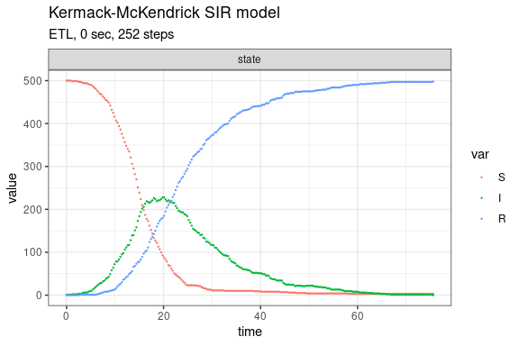
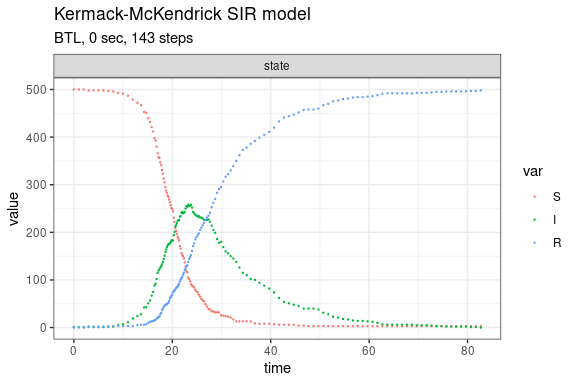

Kermack-McKendrick SIR model (Brown & Rothery, 1993)
================

<!-- github markdown built using 
rmarkdown::render("vignettes/sir.Rmd", output_format = "github_document")
-->

The Kermack-McKendrick SIR model is defined as

    dS/dt = -beta*N*S
    dI/dt = beta*N*S - gamma*I
    dR/dt = gamma*I

This model consists of two reactions with the following per capita
rates,

    transmission: beta
    recovery:     gamma

Define parameters

``` r
library(gillespie)
sim_name <- "Kermack-McKendrick SIR model"
params <- c(beta = .001, gamma = .1)
final_time <- 100
initial_state <- c(S = 500, I = 1, R = 0)
```

Define reactions

``` r
reactions <- list(
  reaction("beta * S * I", c(S = -1, I = +1)),
  reaction("gamma * I", c(I = -1, R = +1))
)
```

Run simulations with the Direct method

``` r
set.seed(1)
out <- ssa(
  initial_state = initial_state,
  reactions = reactions,
  params = params,
  final_time = final_time,
  method = ssa_direct(),
  sim_name = sim_name
) 
ssa_plot(out)
```


Run simulations with the Explict tau-leap method

``` r
set.seed(1)
out <- ssa(
  initial_state = initial_state,
  reactions = reactions,
  params = params,
  final_time = final_time,
  method = ssa_etl(),
  sim_name = sim_name
) 
ssa_plot(out)
```



Run simulations with the Binomial tau-leap method

``` r
set.seed(1)
out <- ssa(
  initial_state = initial_state,
  reactions = reactions,
  params = params,
  final_time = final_time,
  method = ssa_btl(),
  sim_name = sim_name
) 
ssa_plot(out)
```


